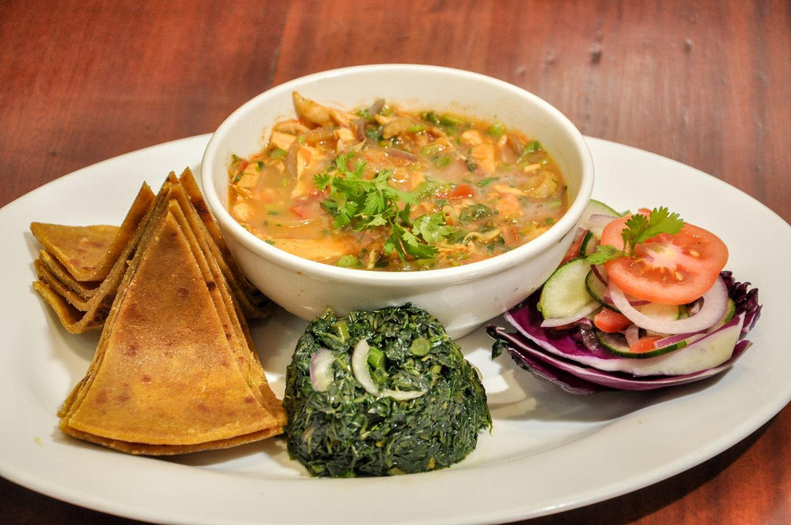

# Exploring-Nairobi Restaurants

## Problem: Discovering Restaurants in Nairobi Residential Areas.
Nairobi is an perhaps the biggest economic hub in East and Central Africa. Here we will try to analyze  the restaurant scene in Kenya's capital.
## Clients that this may be of interest to.
- Business personnel who wants to invest or open a restaurant. 
- Freelancer who loves to have their own restaurant as a side business. 
- Data Scientists, who may want to implement similar projects.

## Data Preparation
### Scraping and getting coordinates
Scrapped the data from "https://hassconsult.co.ke/real-estate/images/HassLandIndexQ12021.pdf" with the help of Tabula and requests to create a data frame and found the longitude and latitude of Suburbs and Satelite towns of Nairobi using geocoder

## Using Foursquare Location Data:
Foursquare data is commonly used to power location data for Airbnb, Apple Maps, Samsung, TripAdvisor, Spotify, AccuWeather, and Uber. For this problem I have used the Foursquare API to retrieve information about 100 restaurants in a 1000 meter radius of suburban and satelite towns in Nairobi for analysis.

## Popular cuisines
### Restaurants in the Suburbs of Nairobi

The broadly unspecified restaurant category is the most popular category followed by fast foo restaurants then Indian food based restaurants. African, Italian, Chinese, Ethiopian, Asian, Japanese and Mediterranean categories complete the top 10 categories.

### Restaurants in the Satelites of Nairobi

With limited data for the satelite towns of Nairobi, fast food restaurants are the most popular in this category. Closely followed by Restaurant, African and finally Chinese

Here are their locations on a map

